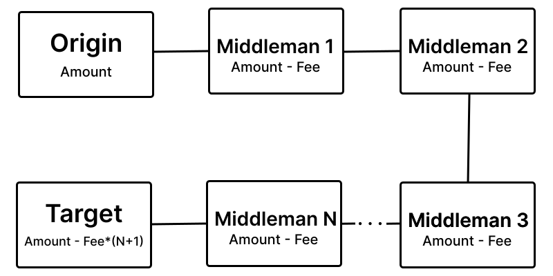
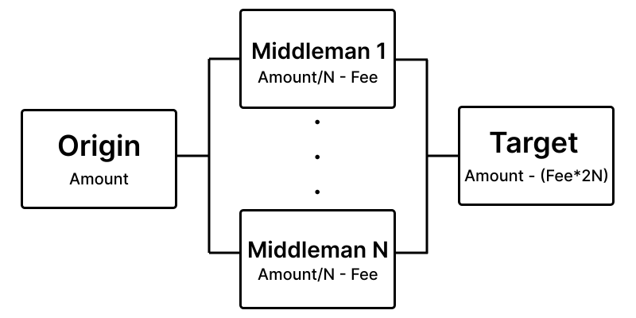

# Monero Transaction Obfuscator

This project provides strategies to sequentially transfer Monero (XMR) through multiple wallets to obfuscate the source of funds. It uses **Playwright** to interact with [MyMonero](https://wallet.mymonero.com) browser wallets.

## Features

* **Wallet Generation & Management**

  * Generate new wallets via MyMonero.
  * Load wallets from files containing mnemonics.
  * Access wallet balances and keys.
  * Bulk wallet generation support.
  * Context manager support with `async with` for safe login and cleanup.

* **Mixing Strategies**

  * `DominoMixer`: Transfers funds sequentially through middleman wallets to the destination.
    <p></p>
    
    <p></p>
    <br>
  * `LeafwayMixer`: Splits the amount across multiple middlemen, then consolidates funds to the destination wallet.
    <p></p>
    
    <p></p>
    <br>
* **Retry Logic**: Automatically retries failed transactions.

* **Customizable Transfer Priorities and Timing**.

## Installation

```bash
git clone https://github.com/cvcvka5/Monero-Mixer.git
cd Monero-Mixer
pip install -r requirements.txt
```

**Dependencies**

* Python 3.11+
* `playwright` (with browsers installed)
* `xmr` custom library for wallet interactions

```bash
playwright install
```

## Usage

### Example: Domino Mixer

```python
import asyncio
from xmr.Wallet import Wallet
from mixer import WalletChain, DominoMixer

async def main():
    wallets = Wallet.loadWallets('wallets.txt')
    chain = WalletChain(from_wallet=wallets[0], middlemen=wallets[1:3], to_wallet=wallets[3])

    mixer = DominoMixer(chain)
    await mixer.start(amount=1.5)

asyncio.run(main())
```

### Example: Leafway Mixer

```python
import asyncio
from xmr.Wallet import Wallet
from mixer import WalletChain, LeafwayMixer

async def main():
    wallets = Wallet.loadWallets('wallets.txt')
    chain = WalletChain(from_wallet=wallets[0], middlemen=wallets[1:3], to_wallet=wallets[3])

    mixer = LeafwayMixer(chain)
    await mixer.start(amount=2.0)

asyncio.run(main())
```

### Example: Generate One Wallet

```python
import asyncio
from xmr.Wallet import Wallet

async def main():
    wallet = await Wallet.generateNew()
    print(f"Generated wallet mnemonic: {wallet.mnemonic}")
    print(f"Address: {wallet.address}")
    print(f"View Key: {wallet.secretViewKey}")
    print(f"Spend Key: {wallet.secretSpendKey}")

asyncio.run(main())
```

### Example: Bulk Wallet Generation

```python
import asyncio
from xmr.Wallet import Wallet

async def main():
    wallets = await Wallet.generateBulk('wallets_bulk.txt', max_workers=5, total=50)
    for w in wallets:
        print(w)

asyncio.run(main())
```

### Example: Using Wallet as Context Manager

```python
import asyncio
from xmr.Wallet import Wallet

async def main():
    wallets = Wallet.loadWallets('wallets.txt')
    async with wallets[0] as active_wallet:
        balance = await active_wallet.getBalance()
        transferFee = await active_wallet.getTransferFee(priority="low")
        await active_wallet.send(balance-transferFee, "to_address", priority="low")
      
        print(f"Remaining wallet balance: {await active_wallet.getBalance()} XMR")

asyncio.run(main())
```

## Project Structure

```
project/
├─ xmr/
│  ├─ Wallet.py         # Wallet management
│  ├─ Mnemonic.py       # Mnemonic handling
│  ├─ exceptions/       # Custom exceptions
│  └─ Mixer.py          # DominoMixer & LeafwayMixer classes
├─ main.py              # Your main.py file
└─ README.md
```

## Notes

* **Playwright** launches a browser for each wallet session; ensure system resources are sufficient.
* Transaction fees and transfer delays are configurable.
* Use responsibly and test with low amounts first.
* Bulk generation can create many wallets quickly; ensure disk space for mnemonic storage.
* `async with` ensures browser sessions are properly closed, avoiding resource leaks.

## License

MIT License.
